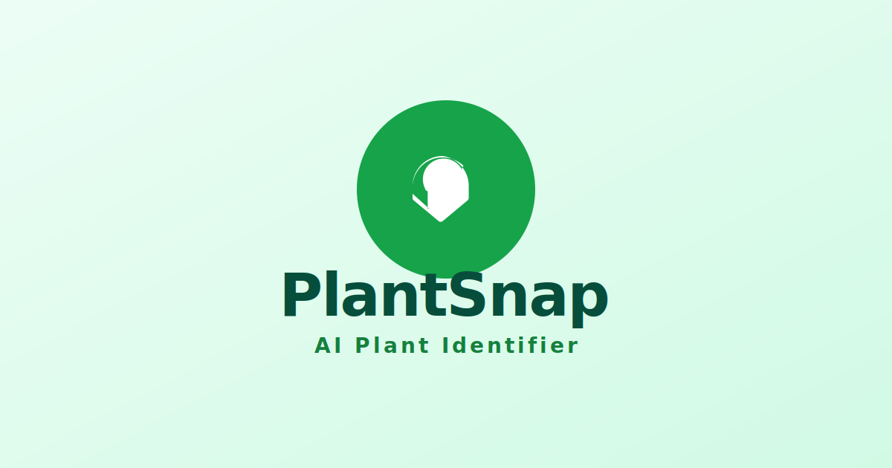

# PlantSnap - AI Plant Identifier 🌿

PlantSnap is a modern web application powered by **Google Gemini AI** that allows users to instantly identify plants, assess their health, and receive eco-friendly care instructions.



## 🚀 Features

*   **Instant Identification**: Snap a photo or upload an image to identify plants immediately using the Gemini 2.5 Flash model.
*   **Health Assessment**: Automatically detects diseases, pests, or health issues and suggests treatments.
*   **Eco-Friendly Advice**: Provides organic pest control methods and companion planting suggestions.
*   **Plant Collection History**: Automatically saves your identified plants to a local collection for future reference.
*   **Detailed Care Guides**: Specific instructions for sunlight, watering, and soil requirements.

## 🛠️ Tech Stack

*   **Frontend**: React 19 (TypeScript)
*   **Styling**: Tailwind CSS
*   **AI Model**: Google Gemini 2.5 Flash (`@google/genai`)
*   **State Management**: React Hooks + LocalStorage
*   **Build Tool**: ESBuild (implied by environment)

## 📦 Installation & Setup

1.  **Clone the repository**
2.  **Install dependencies**
    ```bash
    npm install
    ```
3.  **Configure API Key**
    *   Get your API key from [Google AI Studio](https://aistudio.google.com/).
    *   Set the `API_KEY` environment variable in your project configuration.
4.  **Run the application**
    ```bash
    npm start
    ```

## 📱 Usage

1.  **Home Screen**: Select "Take Photo" (mobile) or "Upload Photo" (desktop/mobile).
2.  **Analysis**: Wait a few seconds for the AI to analyze the image.
3.  **Results**: View the plant name, health status, and care guide.
4.  **History**: Navigate to the "History" tab to view past scans, filterable by "Healthy" or "Issues".

## 📄 License

MIT
